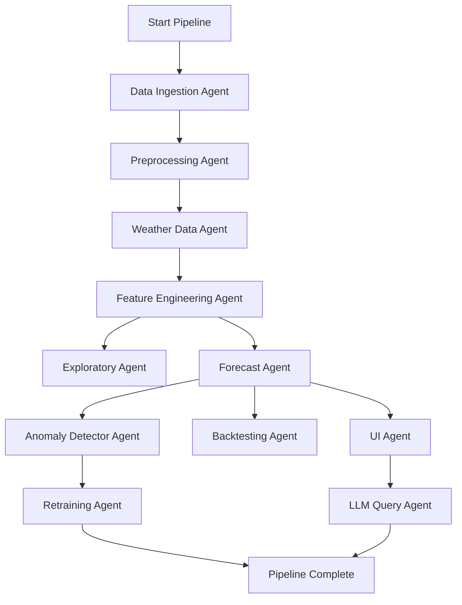
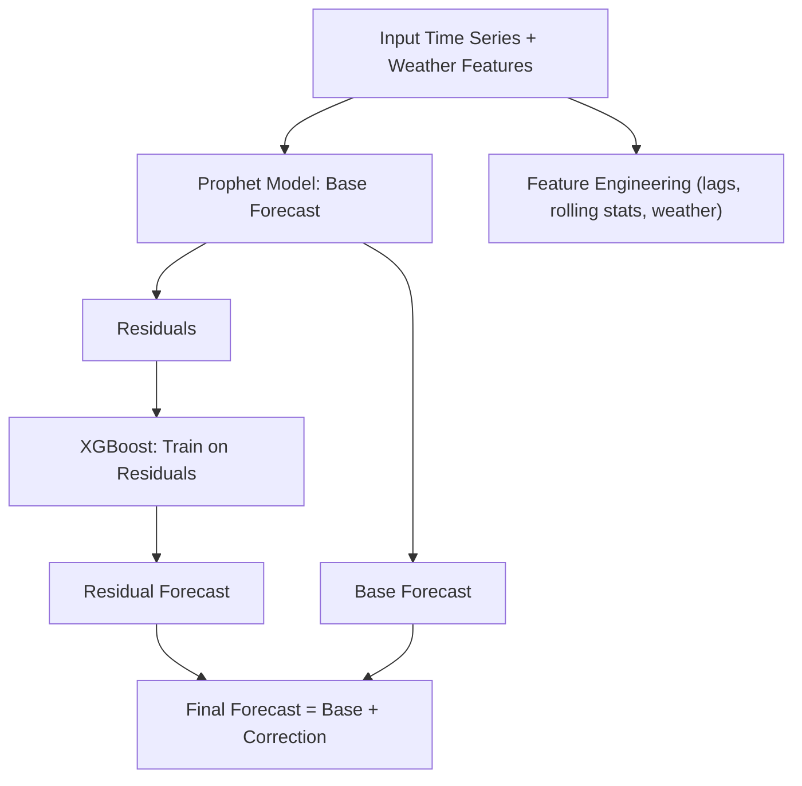

# ☀️ Solar Energy Forecasting System & Agentic AI Playbook

This document serves as both a practical guide for running the current application and a high-level playbook for the long-term vision of this agentic AI forecasting system.

---

## 🚀 Getting Started: Technical Implementation

This section provides the technical details to set up and run the existing solar forecasting application.

### 📋 Prerequisites

-   Python 3.8+
-   `pip` and `venv`

### 🔧 Installation & Setup

1.  **Clone the Repository**
    ```bash
    git clone https://github.com/manoharpavuluri/forecasting_v0.git
    cd forecasting_v0
    ```
2.  **Set Up the Environment**
    You can use the provided scripts to create a virtual environment and install dependencies.
    **For macOS/Linux:**
    ```bash
    sh setup_venv.sh
    ```
    **For Windows:**
    ```batch
    setup_venv.bat
    ```
    These scripts will create a `venv` folder, activate it, and install packages from `requirements.txt`.

### 🔑 Configuration

This project requires API keys for Google Maps (for geocoding) and Open-Meteo (for weather data).

1.  Create a file named `.env` in the root directory.
2.  Add your API keys to the `.env` file:
    ```
    GOOGLE_MAPS_API_KEY="your_google_maps_api_key"
    OPEN_METEO_API_KEY="your_open_meteo_api_key"
    ```

### 🏃‍♀️ Running the Application

1.  Make sure your virtual environment is activated.
    ```bash
    source venv/bin/activate
    ```
2.  Run the Streamlit application:
    ```bash
    streamlit run app.py
    ```
The application will open in your default web browser.

### 🖥️ How to Use the Application

1.  **Upload Data**: Use the file uploaders or place large files directly in the `data/` directory.
2.  **Select Files**: Choose your meter and site data files from the dropdowns.
3.  **Run Pipeline**: Click the "Run Preprocessing Pipeline" to start the workflow.
4.  **View Outputs**: Processed files appear in the `data/processed/` directory.

--- ## 🤖 Agentic AI Playbook (System Vision)

This playbook outlines the long-term vision, architecture, and technical design for a comprehensive, multi-agent AI forecasting system.

### 🎯 Objective

To design and deploy a multi-agent AI system that autonomously ingests, analyzes, forecasts, and explains solar energy production using time series data and external weather APIs. The system provides insights, detects anomalies, and supports user queries through a natural language interface.

---

### 🗺️ Project Roadmap

This phased build sequence is optimized for incremental development, early testing, and production readiness.

#### **Phase 1: Core Agents + Minimal UI (MVP)**

- **Data Ingestion Agent** – Start with Polars to process a smaller CSV subset to Parquet.
- **Preprocessing Agent** – Add timestamp normalization and missing value handling.
- **Forecast Agent (Prophet-only)** – Implement baseline daily/hourly forecast.
- **UI Agent (Streamlit MVP)** – Add:
  - CSV file upload for ingestion
  - Trigger for running Prophet forecast
  - Line chart showing forecast vs actual

#### **Phase 2: Full Feature and Modeling Expansion**

- **Weather Data Agent** – Fetch OpenWeatherMap and Open-Meteo data.
- **Feature Engineering Agent** – Add rolling stats, lags, interactions.
- **Forecast Agent (Hybrid)** – Add XGBoost to residual correction pipeline.
- **UI Agent Enhancements** – Add:
  - Site/date dropdowns
  - Weather overlay toggle
  - Forecast version comparison

#### **Phase 3: Intelligence & Automation Layer**

- **Anomaly Detector Agent** – z-score detection on residuals.
- **Model Selector Agent** – Tune Prophet/XGBoost.
- **Backtesting Agent** – Sliding window evaluation, error tracking.
- **Retraining Agent** – Threshold-based model refresh.

#### **Phase 4: Orchestration + Query Interface**

- **LLM Query Agent** – Streamlit + LangChain GPT-4o integration.
- **Supervisor Agent** – LangGraph-based execution DAG across all agents.
- **UI Agent Finalization** – Add:
  - Natural language chat tab
  - Anomaly explorer tab
  - Backtest viewer

---

### 🏛️ System Architecture

This section describes the high-level components (the agents) and how they interact.

#### Agent Responsibilities
Each agent plays a specialized role in the end-to-end pipeline.
- **Data Ingestion Agent:** Converts bulky CSVs to optimized Parquet files.
- **Preprocessing Agent:** Ensures clean, consistent time series.
- **Weather Data Agent:** Fetches and aligns weather data.
- **Feature Engineering Agent:** Creates model features from raw data.
- **Exploratory Agent:** Visualizes trends, gaps, and anomalies.
- **Forecast Agent:** Core agent for producing forecasts.
- **Model Selector Agent:** Tunes model hyperparameters.
- **Anomaly Detector Agent:** Detects unexpected errors in forecasts.
- **Retraining Agent:** Retrains models when performance degrades.
- **UI Agent:** Serves as the central user interface.
- **LLM Query Agent:** Enables natural language queries.
- **Supervisor Agent:** Coordinates the execution of all other agents.

#### Agentic System Flow
The following LangGraph DAG defines the execution flow and data dependencies between agents:



---

### 🛠️ Technical Specification & Design

This section provides detailed build instructions for each agent in the forecasting system.

#### 📥 Data Ingestion Agent

**Technology:** Polars (local) + Apache Spark (scalable/cloud)
**Responsibilities:**
- Ingest solar production data from large CSV files.
- Convert CSV to Parquet for efficient downstream processing.
- Enable scalable, multi-threaded ingestion both locally and on Spark.

---

### 📈 Strategic Overview

This section describes the high-level strategic decisions made for the project, including modeling approaches and data handling at scale.

#### Model Choices & Forecasting Strategy
The production pipeline uses a **hybrid model** (Prophet + XGBoost) to balance interpretability and accuracy.

**Forecasting Pipeline Diagram:**


#### High-Volume Data Strategy
For processing datasets larger than can be handled locally (~30-40GB), a cloud-based approach is recommended.
-   **Local Development**: Use **Polars** or **DuckDB** for exploration. Run models on sampled data.
-   **Cloud Deployment (Azure)**: Use for data ingestion >40GB, fleet-level forecasting, and CI/CD.
    -   **Azure Blob Storage**: Store raw & processed Parquet files.
    -   **Azure Synapse + Spark pools**: Scalable ETL and modeling.
    -   **Azure ML**: Distributed model training and deployment.
    -   **Azure Data Factory / Airflow**: Scheduling and orchestration.

---

### 📦 Tech Stack Summary

| Component              | Tool                         |
| ---------------------- | ---------------------------- |
| Orchestration          | LangGraph                    |
| ETL/Workflow           | PySpark, Airflow             |
| Forecasting            | Hybrid (Prophet + XGBoost)   |
| Anomaly Detection      | z-score on Prophet residuals |
| Visualization          | Streamlit + Plotly           |
| Natural Language Layer | LangChain + GPT-4o           |
| Vector/Query Layer     | DuckDB                       |
| Model Registry         | MLflow                       |
| Scheduler              | Airflow                      |

---

### 📌 Next Steps

To operationalize the system, here are the prioritized next actions:

1.  **Develop a Streamlit Dashboard powered by Forecast Agent and UI Agent**
2.  **Set up a LangChain LLM Interface to Enable User Queries**
3.  **Build a Backtesting Pipeline to Evaluate Model Performance Weekly** 