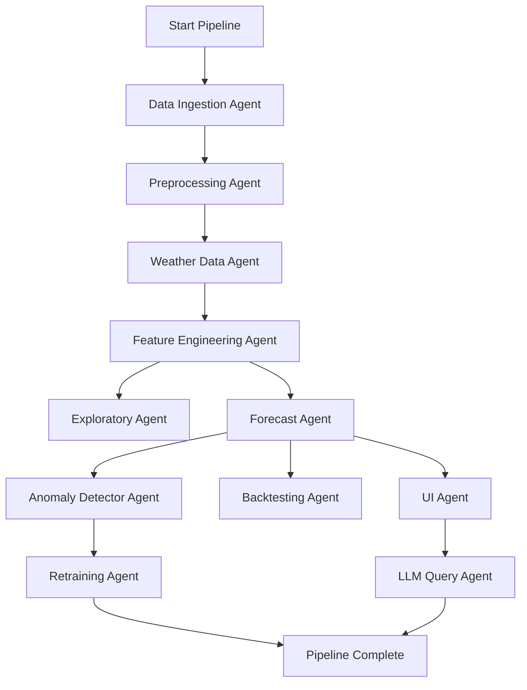

## ☀️ Agentic AI Playbook for Solar Time Series Forecasting

### 🎯 Objective

To design and deploy a multi-agent AI system that autonomously ingests, analyzes, forecasts, and explains solar energy production using time series data and external weather APIs. The system provides insights, detects anomalies, and supports user queries through a natural language interface.

---

### 🧠 Agent Architecture and Responsibilities

This section provides detailed build instructions for each agent in the LangGraph-orchestrated forecasting system. Each agent includes:

- Purpose
- Finalized technology
- Step-by-step build instructions
- Scaling guidance for high-volume datasets

---

#### 📥 Data Ingestion Agent

**Technology:** Apache Spark

**Responsibilities:**

- Ingest solar production data from CSV/Parquet and SQL Server.
- Fetch external weather data.

**Build Steps:**

1. Configure Spark session (local or Synapse).
2. Use `spark.read.csv` or `spark.read.parquet` for batch files.
3. For SQL Server: use Spark JDBC connector (`spark.read.format("jdbc")`).
4. Store all ingested data into Azure Blob Storage in Parquet format.
5. Trigger ingestion from Airflow DAG or LangGraph node.

**Scaling Tips:**

- Partition by site and date to parallelize.
- Use `.repartition()` before write.

---

#### 🧹 Preprocessing Agent

**Technology:** PySpark

**Responsibilities:**

- Normalize timestamps.
- Fill missing values and remove outliers.

**Build Steps:**

1. Align timezones and convert timestamps to UTC.
2. Fill gaps using Spark window functions (`last`, `lead`, `lag`).
3. Apply outlier logic (e.g., IQR or z-score) using SQL expressions.
4. Persist cleaned data in Parquet.

**Scaling Tips:**

- Use Spark SQL for large-scale filter operations.

---

#### 🌦️ Weather Data Agent

**Technology:** OpenWeatherMap API + NOAA FTP + Open-Meteo API + Python

**Responsibilities:**

- Fetch forecast and recent historical weather data from OpenWeatherMap.
- Fetch scalable historical weather backfill from Open-Meteo for large volumes of past data.
- Retrieve accurate long-term historical weather data from NOAA.
- Align and integrate weather metrics with production solar data.

**Build Steps:**

1. Use `requests` or `httpx` to fetch recent/forecast hourly data from OpenWeatherMap and Open-Meteo.
2. Use Python's `ftplib` or NOAA’s public download URLs to ingest CSV/TXT climate data for historical backfill.
3. Parse NOAA files and standardize schema to match OpenWeatherMap’s output.
4. Normalize timestamps and align both sources using DuckDB.
5. Join resulting weather data with production data by location and timestamp.
6. Store unified weather dataset in Azure Blob Storage as partitioned Parquet.

**Scaling Tips:**

- For OpenWeatherMap, batch API calls per location/day and use an exponential backoff retry loop.
- Schedule NOAA and Open-Meteo ingestion and ETL separately (e.g., monthly), storing source archives in a cold storage tier.
- Pre-join and version unified weather data for downstream use by feature engineering and forecasting agents.

---

#### 🔧 Feature Engineering Agent

**Technology:** Spark SQL

**Responsibilities:**

- Generate time-based and weather-derived features.

**Build Steps:**

1. Add rolling means, lags (1h, 24h), and difference features.
2. Encode weather signals (temp \* irradiance, cloud index).
3. Output feature table to Parquet.

**Scaling Tips:**

- Use Spark temp views for modular pipeline chaining.

---

#### 📊 Exploratory Agent

**Technology:** Plotly

**Responsibilities:**

- Visualize trends, completeness, and anomalies.

**Build Steps:**

1. Load preprocessed data in Streamlit.
2. Use Plotly for time series line charts and histograms.
3. Downsample using DuckDB for large datasets.

**Scaling Tips:**

- Use Streamlit selectbox filters to minimize live plotting scope.

---

#### 🔮 Forecast Agent

**Technology:** Hybrid (Prophet + XGBoost)

**Responsibilities:**

- Generate forecasts.
- Blend base forecast + residual correction.

**Build Steps:**

1. Train Prophet model on base production time series.
2. Compute residuals.
3. Build feature set from lagged values + weather.
4. Train XGBoost on residuals.
5. Final forecast = Prophet + XGBoost output.

**Scaling Tips:**

- Train Prophet per-site.
- Train XGBoost on clusters of similar sites to generalize.

---

#### 🎯 Model Selector Agent

**Technology:** GridSearchCV

**Responsibilities:**

- Optimize Prophet parameters.

**Build Steps:**

1. Define parameter grid (seasonality, changepoint scale).
2. Use cross-validation on training set.
3. Save best model to MLflow.

**Scaling Tips:**

- Run hyperparameter tuning in batch mode overnight.

---

#### 🚨 Anomaly Detector Agent

**Technology:** z-score

**Responsibilities:**

- Identify performance outliers.

**Build Steps:**

1. Compute z-score on residuals.
2. Flag any forecast with |z| > 2.5.
3. Join flag to forecast output.

**Scaling Tips:**

- Use SQL logic for in-line z-score tagging.

---

#### 🔁 Retraining Agent

**Technology:** MLflow + Airflow

**Responsibilities:**

- Trigger model retraining if error exceeds threshold.

**Build Steps:**

1. Monitor RMSE from backtest results.
2. If threshold exceeded, retrain Prophet + XGBoost.
3. Register updated model to MLflow.
4. Trigger via Airflow scheduler.

**Scaling Tips:**

- Log model metadata with site/time/version info.

---

#### 🖥 UI Agent

**Technology:** Streamlit

**Responsibilities:**

- Present interactive dashboard.

**Build Steps:**

1. Display forecast vs actual plots with Plotly.
2. Add toggles for anomaly visibility.
3. Trigger query routing to LLM agent.
4. Embed backtest chart and metadata table.

**Scaling Tips:**

- Cache long queries with `@st.cache_data`.

---

#### 🧠 LLM Query Agent

**Technology:** LangChain + GPT-4o + DuckDB

**Responsibilities:**

- Translate natural language questions into structured queries.

**Build Steps:**

1. Use LangChain SQLChain with DuckDB.
2. Template prompt: "What caused X on Y date?"
3. Inject filtered data context.
4. Display results in Streamlit as plot or text.

**Scaling Tips:**

- Limit token count with pre-trimmed inputs.

---

#### 🧩 Backtesting Agent

**Technology:** Spark + Plotly

**Responsibilities:**

- Evaluate forecast accuracy over time.

**Build Steps:**

1. Define walk-forward split windows (e.g., 30 days).
2. Compute MAE/RMSE across splits.
3. Log results to MLflow.
4. Visualize in Streamlit with Plotly.

**Scaling Tips:**

- Run backtests on partitioned datasets by site + year.

---

#### 🧭 Supervisor Agent

**Technology:** LangGraph

**Responsibilities:**

- Orchestrate execution flow across agents.

**Build Steps:**

1. Define nodes for each agent.
2. Encode conditional paths and retries.
3. Schedule via Airflow or CLI entrypoint.

**Scaling Tips:**

- Persist agent state in memory for reuse. Answer user questions about forecasts, anomalies, or trends. | LangChain + GPT-4o + DuckDB | Use LangChain with GPT-4o to translate queries into SQL over DuckDB views. Stream results to Streamlit UI. Template prompts to include date/site filters. | Use LangChain with OpenAI GPT-4o and connect to DuckDB as the SQL retriever backend. Build prompt templates that detect the user's intent (e.g., anomaly inspection vs forecast explanation) and convert that into prebuilt SQL queries. Route the result to Streamlit for visualization or as text summaries. Deployed as an async service that is triggered from Streamlit input. | LangChain + OpenAI GPT-4o + DuckDB | LangChain, OpenAI GPT-4o, FAISS, ChromaDB, DuckDB |

---

### 🔄 Agentic System Flow

The following LangGraph DAG defines the execution flow and data dependencies between agents in the forecasting system:



---

### ⚙️ Model Choices by Forecast Agent

| Model                      | Use Case                                                                                                               | Notes                                            |
| -------------------------- | ---------------------------------------------------------------------------------------------------------------------- | ------------------------------------------------ |
| Hybrid (Prophet + XGBoost) | Used in production: Prophet models trend + seasonality; XGBoost corrects residuals using weather and calendar features | Best balance between accuracy and explainability |

**Final Architecture Decision:** The production pipeline uses a **hybrid model** approach — Prophet handles base time series forecasting, while XGBoost is used to model the residuals as a function of weather and metadata features. This allows:

- Easy interpretability from Prophet
- Improved accuracy from XGBoost corrections
- Modular training and retraining components

**How This Works in the Forecast Agent:**

1. **Train Prophet** on the cleaned, aggregated solar energy time series (e.g., hourly or daily).
2. **Compute residuals** between actuals and Prophet's forecast.
3. **Create features**: Combine lagged solar values, rolling means, weather parameters (e.g., irradiance, temperature, cloud cover), and time-based features (e.g., hour of day, day of week).
4. **Train XGBoost** on those residuals using the engineered features.
5. **Forecast pipeline**:
   - Prophet generates the baseline forecast.
   - XGBoost predicts the residual correction.
   - Final forecast = Prophet forecast + XGBoost correction.
6. **Integrate with Backtesting Agent** for rolling error evaluation.

---

### 🔁 Forecasting Pipeline Diagram

```mermaid
graph TD
    A[Input Time Series + Weather Features] --> B[Prophet Model: Base Forecast]
    A --> C[Feature Engineering (lags, rolling stats, weather)]
    B --> D[Residuals]
    D --> E[XGBoost: Train on Residuals]
    E --> F[Residual Forecast]
    B --> G[Base Forecast]
    F --> H[Final Forecast = Base + Correction]
    G --> H
```

| Model                      | Use Case                                                                                                               | Notes                                            |
| -------------------------- | ---------------------------------------------------------------------------------------------------------------------- | ------------------------------------------------ |
| Prophet                    | Primary engine for daily/hourly forecasting with strong seasonality and trend detection                                | Interpretable, low-code, and fast to deploy      |
| Hybrid (Prophet + XGBoost) | Used in production: Prophet models trend + seasonality; XGBoost corrects residuals using weather and calendar features | Best balance between accuracy and explainability |

**Final Architecture Decision:** The production pipeline uses a **hybrid model** approach — Prophet handles base time series forecasting, while XGBoost is used to model the residuals as a function of weather and metadata features. This allows:

- Easy interpretability from Prophet
- Improved accuracy from XGBoost corrections
- Modular training and retraining components

LSTM, GRU, and TFT were excluded due to high complexity and compute needs, which are not justified for our deployment and user interface requirements. | --------------------------- | ---------------------------------------------- | ---------------------------------- | | Prophet                     | Strong seasonality and trend detection         | Interpretable, easy to tune        | | XGBoost                     | Mixed features and weather data                | Great for feature-rich scenarios   | | LSTM/GRU                    | Sequence modeling with long memory             | Requires high training effort      | | Temporal Fusion Transformer | Multivariate time series with attention        | Best-in-class, higher compute cost | | Hybrid (Prophet + XGBoost)  | Combine trend with weather feature corrections | Useful in production blends        |

---

### 🆕 Backtesting Agent

**Purpose**: Evaluate forecast robustness using rolling historical windows.

**Capabilities**:

- Walk-forward validation
- Collect RMSE, MAE, and MAPE metrics
- Identify model drift or retraining triggers

**Sample Function**:

```python
def backtest_model(model, df, window=30):
    results = []
    for start in range(0, len(df) - window, window):
        train = df.iloc[:start+window]
        test = df.iloc[start+window:start+2*window]
        model.fit(train)
        forecast = model.predict(len(test))
        error = evaluate(test, forecast)
        results.append(error)
    return pd.DataFrame(results)
```

---

### 🧠 LLM Query Agent

**Purpose**: Allows natural language queries on time series data, anomalies, model decisions, and more.

**Capabilities**:

- Translate questions to SQL/DataFrame queries
- Retrieve summaries, comparisons, or insights
- Provide reasons behind forecast deviations

**Sample Queries**:

- "Why was solar output low on May 12?"
- "Compare predicted vs. actual for the last 7 days at site CA-02"
- "Which weather factor most influenced yesterday's output?"

**Architecture**:

- LangChain with OpenAI GPT-4o
- VectorDB (Chroma/FAISS) for metadata storage
- SQL engine (DuckDB) or Spark for fast computation

**Code Sketch**:

```python
query = "Why did solar dip last Friday?"
response = llm_chain.run(query)
# "Solar output dropped due to low irradiance (135 W/m^2) and 79% cloud cover."
```

---

### 🌦️ Weather Data Strategy

| API                | Use                             | Notes                                 |
| ------------------ | ------------------------------- | ------------------------------------- |
| **NOAA**           | Historical ground-truth         | Requires ETL effort, reliable         |
| **OpenWeatherMap** | Forecasts + historical backfill | Easier to integrate, commercial terms |
| **Open-Meteo**     | Backup or alternative           | Free tier, fewer features             |

Variables to Track:

- Solar irradiance
- Cloud cover
- Ambient temperature
- Wind speed (for panel cooling)
- Precipitation, humidity (for cleanliness/dust impact)

---

### ⚡ High-Volume Data Strategy (MacBook Pro M4 Max Guidance)

Your MacBook Pro M4 Max (14-core CPU, 36 GB RAM) is a powerful local workstation capable of processing up to \~20–40 GB datasets using multi-threaded Python or local Spark. For processing full 100GB+ solar datasets, a hybrid approach is ideal:

#### What You Can Do Locally on Mac M4 Max:

- Use **DuckDB** or **Polars** for local data exploration and ETL up to \~30GB.
- Run **Prophet**, **XGBoost**, and even **small LSTM models** on sampled data.
- Use **Spark (standalone)** locally with 12–16 worker threads for partitioned Parquet file processing.
- Visualize with **Plotly/Streamlit** interactively.

#### When to Use Azure:

- Data ingestion exceeds \~30GB and involves multi-year/multi-site input.
- Forecasting at the fleet level (hundreds of panel arrays or 15-minute resolution data).
- Parallel hyperparameter tuning for models.
- You want to orchestrate periodic backfills, retraining, or build a CI/CD pipeline.

#### Recommended Azure Technologies:

- **Azure Blob Storage** – store raw & processed Parquet files.
- **Azure Synapse + Spark pools** – scalable ETL, feature engineering, and modeling.
- **Azure ML** – for training and deploying distributed models (TFT, LSTM, Prophet).
- **Azure Data Factory or Airflow on Azure Container Apps** – scheduling and orchestration.

---

When working with high-volume solar datasets (e.g., 100+ GB files or trillions of records):

- **Data Ingestion**:

  - Use **Apache Spark** or **PySpark** for distributed processing. Spark can efficiently read and chunk large CSV, Parquet, or Delta Lake formats.
  - Convert incoming CSV files into **Parquet** format for optimized read/write performance and reduced I/O.
  - For weather APIs, use **asynchronous** requests (`aiohttp`) to minimize bottlenecks when retrieving high-frequency data.

- **Storage & Access**:

  - Store raw and processed data in **cloud blob storage** (Azure Blob, S3) or **Delta Lake** for scalable access.
  - Use **HDFS** or **Databricks File System (DBFS)** when processing at scale.

- **Processing**:

  - For batch processing and aggregations, prefer **Spark DataFrames** over Pandas.
  - Cache intermediate transformations to reduce recomputation when chaining operations.
  - Use **partitioning strategies** (e.g., by date/site) to parallelize processing.

- **Deployment**:

  - Use **Airflow** or **Azure Data Factory** to schedule ingestion and processing pipelines.
  - Monitor pipeline performance using Spark UI or job logs.

- **Modeling at Scale**:

  - Train models using **Spark MLlib**, **Dask**, or offload to cloud services (e.g., SageMaker, Azure ML) for large workloads.
  - For deep learning on big data, use **Petastorm** + **PyTorch** with distributed training.

---

### 📦 Tech Stack Summary (Finalized)

| Component              | Tool                         |
| ---------------------- | ---------------------------- |
| Orchestration          | LangGraph                    |
| ETL/Workflow           | PySpark, Airflow             |
| Forecasting            | Hybrid (Prophet + XGBoost)   |
| Anomaly Detection      | z-score on Prophet residuals |
| Visualization          | Streamlit + Plotly           |
| Natural Language Layer | LangChain + GPT-4o           |
| Vector/Query Layer     | DuckDB                       |
| Model Registry         | MLflow                       |
| Scheduler              | Airflow                      |

| Component              | Tool                        |
| ---------------------- | --------------------------- |
| ETL/Workflow           | PySpark, Airflow, LangGraph |
| Forecasting            | Prophet, LSTM, XGBoost, TFT |
| Anomaly Detection      | STL, Isolation Forest       |
| Visualization          | Streamlit, Plotly, seaborn  |
| Orchestration          | CrewAI, LangGraph           |
| Natural Language Layer | LangChain + GPT-4o          |
| Vector DB              | FAISS or ChromaDB           |
| Model Registry         | MLflow                      |
| Scheduler              | Airflow or Prefect          |

---

### 📌 Next Steps

Options to proceed:

1. Develop a **Streamlit Dashboard** powered by the Forecast Agent and UI Agent
2. Set up a **LangChain LLM interface** to enable user queries
3. Build a **backtesting pipeline** to evaluate model performance weekly
4. Package everything into a **GitHub starter repo** with Docker support

Let me know which track to build first.

