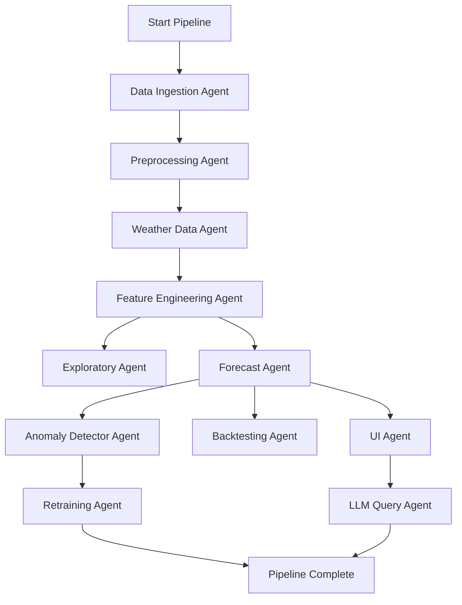

## ☀️ Agentic AI Playbook for Solar Time Series Forecasting

### 🎯 Objective

To design and deploy a multi-agent AI system that autonomously ingests, analyzes, forecasts, and explains solar energy production using time series data and external weather APIs. The system provides insights, detects anomalies, and supports user queries through a natural language interface.

---

### 🧠 Agent Architecture and Responsibilities

---

### 🏗️ Recommended Build Order (Optimized for Development + Testing)

To support incremental development, early testing, and production readiness, follow this phased build sequence:

#### **Phase 1: Core Agents + Minimal UI (MVP)**

- **Data Ingestion Agent** – Start with Polars to process a smaller CSV subset to Parquet.
- **Preprocessing Agent** – Add timestamp normalization and missing value handling.
- **Forecast Agent (Prophet-only)** – Implement baseline daily/hourly forecast.
- **UI Agent (Streamlit MVP)** – Add:
  - CSV file upload for ingestion
  - Trigger for running Prophet forecast
  - Line chart showing forecast vs actual

#### **Phase 2: Full Feature and Modeling Expansion**

- **Weather Data Agent** – Fetch OpenWeatherMap and Open-Meteo data.
- **Feature Engineering Agent** – Add rolling stats, lags, interactions.
- **Forecast Agent (Hybrid)** – Add XGBoost to residual correction pipeline.
- **UI Agent Enhancements** – Add:
  - Site/date dropdowns
  - Weather overlay toggle
  - Forecast version comparison

#### **Phase 3: Intelligence & Automation Layer**

- **Anomaly Detector Agent** – z-score detection on residuals.
- **Model Selector Agent** – Tune Prophet/XGBoost.
- **Backtesting Agent** – Sliding window evaluation, error tracking.
- **Retraining Agent** – Threshold-based model refresh.

#### **Phase 4: Orchestration + Query Interface**

- **LLM Query Agent** – Streamlit + LangChain GPT-4o integration.
- **Supervisor Agent** – LangGraph-based execution DAG across all agents.
- **UI Agent Finalization** – Add:
  - Natural language chat tab
  - Anomaly explorer tab
  - Backtest viewer

This phased build order allows continuous testing and stakeholder demos starting as early as Phase 1, while keeping backend agent expansion modular and scalable.

Each agent plays a specialized role in the end-to-end pipeline. Below is a summary of recommended actions or scenarios for which each agent should be used:

---

### Agent Usage Guide

#### 📥 Data Ingestion Agent

- Use when receiving large or raw solar production data files.
- Ideal for one-time ingestion or scheduled periodic imports.
- Converts bulky CSVs to optimized Parquet files for downstream agents.

#### 🧹 Preprocessing Agent

- Use immediately after ingestion to ensure clean, consistent time series.
- Necessary when dealing with missing timestamps, timezones, and data errors.
- Recommended to run before any modeling step.

#### 🌦️ Weather Data Agent

- Fetch this agent's output before feature engineering or forecasting.
- Trigger weekly/monthly for long-term NOAA and Open-Meteo backfill.
- Use daily/hourly for OpenWeatherMap forecasts.

#### 🔧 Feature Engineering Agent

- Use before training or re-training any forecasting model.
- Trigger after any schema update or addition of new weather inputs.

#### 📊 Exploratory Agent

- Use to inspect trends, gaps, and anomalies visually.
- Ideal during development, feature selection, or model debugging.

#### 🔮 Forecast Agent

- Core agent for producing forecasts.
- Run daily or hourly for operational forecasting.
- Trigger retraining if RMSE increases from Backtesting Agent.

#### 🎯 Model Selector Agent

- Run when tuning Prophet or XGBoost hyperparameters.
- Use during model onboarding, quarterly refresh, or post-drift detection.

#### 🚨 Anomaly Detector Agent

- Use after forecast generation to detect unexpected errors.
- Helpful for QA dashboards and alerting workflows.

#### 🔁 Retraining Agent

- Runs only when Backtesting Agent signals degradation.
- Triggered via threshold logic or Airflow DAGs.

#### 🖥 UI Agent

**Technology:** Streamlit

**Responsibilities:**

- Display forecasts, anomalies, backtest metrics, and user query results interactively.
- Serve as the central interface for business stakeholders and technical users.

**Build Steps:**

1. Load final forecast and anomaly-tagged datasets from Parquet using DuckDB.
2. Display Plotly line chart: forecast vs actual with anomaly highlights.
3. Add dropdowns for site/date selection, and toggles for overlaying weather.
4. Route user-entered natural language queries to LLM agent.
5. Display backtest performance charts and data tables.

**Optional Agent Integrations:**

- Include a **file upload section** that directly invokes the Data Ingestion Agent using Polars or Spark backend.
- Include a **weather API configuration form** that allows user to input site coordinates and date ranges to trigger the Weather Data Agent.

**Scaling Tips:**

- Use `@st.cache_data` for expensive queries or data fetch.
- Modularize Streamlit into tabs (e.g., Forecasts, Anomalies, Query Bot, Ingestion).
- Place UI components close to the source agent to reduce latency.

---

#### 📥 Data Ingestion Agent

**Technology:** Polars (local) + Apache Spark (scalable/cloud)

**Responsibilities:**

- Ingest solar production data from a 100GB CSV file (nearly a trillion records).
- Convert CSV to Parquet for efficient downstream processing.
- Enable scalable, multi-threaded ingestion both locally and on Spark.

**Build Steps (Local using Polars):**

1. Use Polars to read the massive CSV with `low_memory=True`:

```python
import polars as pl
df = pl.read_csv("100gb_file.csv", low_memory=True)
```

2. Write it to Parquet (highly compressed and optimized):

```python
df.write_parquet("100gb_file.parquet")
```

3. Move the Parquet file to a processing location (e.g., Azure Blob Storage or local staging directory).

**Build Steps (Scalable using Spark):**

1. Launch Spark session locally or on Azure Synapse:

```python
from pyspark.sql import SparkSession
spark = SparkSession.builder.appName("Ingest").getOrCreate()
```

2. Read from pre-converted Parquet file:

```python
df = spark.read.parquet("100gb_file.parquet")
```

3. Optionally repartition for parallel processing:

```python
df = df.repartition(100)  # Tune based on cores or cluster
```

4. Persist clean output to a cloud location:

```python
df.write.mode("overwrite").parquet("/mnt/blob/clean_solar_data")
```

5. Trigger ingestion from Airflow or LangGraph Supervisor node.

**Scaling Tips:**

- Always convert CSV to Parquet before Spark ingestion.
- Partition output by `site_id`, `year`, or `timestamp` to enable parallel access.
- Use Polars for fast local ETL; use Spark for distributed workflows.

---

#### 🧹 Preprocessing Agent

**Technology:** PySpark

**Responsibilities:**

- Normalize timestamps to UTC.
- Fill missing time series values.
- Remove outliers using statistical logic.

**Build Steps:**

1. Use Spark SQL to convert all timestamps to UTC and truncate to hourly or daily.
2. Use Spark window functions like `lag`, `lead`, and `last` to detect and fill missing values.
3. Use IQR logic in SQL (e.g., filtering outliers using 1.5 \* IQR) or calculate z-scores and filter rows where |z| > 3.
4. Apply data type enforcement to ensure schema consistency.
5. Write cleaned output to partitioned Parquet files for Feature Engineering Agent.

**Scaling Tips:**

- Use `.repartition()` before write to optimize Spark performance.
- Use `cache()` to speed up repeated DataFrame actions.
- For very large datasets, process site-by-site or time-chunked splits.

---

#### 🌦️ Weather Data Agent

**Technology:** OpenWeatherMap API + NOAA FTP + Open-Meteo API + Python

**Responsibilities:**

- Fetch forecast and recent historical weather data from OpenWeatherMap.
- Fetch scalable historical weather backfill from Open-Meteo for large volumes of past data.
- Retrieve accurate long-term historical weather data from NOAA.
- Align and integrate weather metrics with production solar data.

**Build Steps:**

1. Use `requests` or `httpx` to fetch recent/forecast hourly data from OpenWeatherMap and Open-Meteo.
2. Use Python's `ftplib` or NOAA’s public download URLs to ingest CSV/TXT climate data for historical backfill.
3. Parse NOAA files and standardize schema to match OpenWeatherMap’s output.
4. Normalize timestamps and align both sources using DuckDB.
5. Join resulting weather data with production data by location and timestamp.
6. Store unified weather dataset in Azure Blob Storage as partitioned Parquet.

**Scaling Tips:**

- For OpenWeatherMap, batch API calls per location/day and use an exponential backoff retry loop.
- Schedule NOAA and Open-Meteo ingestion and ETL separately (e.g., monthly), storing source archives in a cold storage tier.
- Pre-join and version unified weather data for downstream use by feature engineering and forecasting agents.

---

#### 🔧 Feature Engineering Agent

**Technology:** Spark SQL

**Responsibilities:**

- Generate rolling statistics, lags, and weather feature interactions.

**Build Steps:**

1. Read cleaned production + weather data from Parquet.
2. Create new time-based features: hour of day, day of week, month.
3. Use Spark window functions to compute rolling averages (e.g., 24h mean, 7-day trend).
4. Compute lagged variables (e.g., production\_1h\_ago, irradiance\_3h\_ago).
5. Create interaction features: `temp * irradiance`, `cloud_cover * wind_speed`, etc.
6. Output engineered feature dataset to Parquet.

**Scaling Tips:**

- Break features into reusable SQL temp views to modularize logic.
- Use `broadcast` joins where one of the datasets (e.g., location metadata) is small.

---

#### 📊 Exploratory Agent

**Technology:** Plotly

**Responsibilities:**

- Visualize trends, completeness, and anomalies.

**Build Steps:**

1. Load preprocessed data in Streamlit.
2. Use Plotly for time series line charts and histograms.
3. Downsample using DuckDB for large datasets.

**Scaling Tips:**

- Use Streamlit selectbox filters to minimize live plotting scope.

---

#### 🔮 Forecast Agent

**Technology:** Hybrid (Prophet + XGBoost)

**Responsibilities:**

- Generate time series forecasts for solar energy output.
- Use Prophet for baseline trend and seasonality modeling.
- Use XGBoost to correct residuals using weather and engineered features.

**Build Steps:**

1. **Train Prophet:**

   - Input: time series aggregated at site/hour/day level.
   - Model configuration: daily/weekly/yearly seasonality, changepoint flexibility.
   - Output: base forecast + residuals (actuals - prediction).

2. **Prepare residual correction features:**

   - Use lagged values (e.g., 1h, 24h production).
   - Add rolling means, cloud cover, irradiance, temp × humidity, and time-based features.

3. **Train XGBoost model:**

   - Input: engineered features + Prophet residuals as target.
   - Tune using GridSearchCV and validate on hold-out window.

4. **Forecasting flow:**

   - Predict base using Prophet.
   - Predict residuals using XGBoost.
   - Combine: `Final Forecast = Prophet + Residual_Prediction`

5. **Output:** Store final forecasts and components (prophet, xgb) in MLflow with metadata.

**Scaling Tips:**

- Train Prophet per site in batch mode.
- Group sites by geography or irradiance profile for shared XGBoost models.
- For very high-resolution data (e.g., 15-min), downsample Prophet input or use local seasonality model.

---

#### 🎯 Model Selector Agent

**Technology:** GridSearchCV

**Responsibilities:**

- Optimize Prophet parameters.

**Build Steps:**

1. Define parameter grid (seasonality, changepoint scale).
2. Use cross-validation on training set.
3. Save best model to MLflow.

**Scaling Tips:**

- Run hyperparameter tuning in batch mode overnight.

---

#### 🚨 Anomaly Detector Agent

**Technology:** z-score

**Responsibilities:**

- Detect abnormal deviations between predicted and actual energy values.
- Tag high-error time windows for alerting or investigation.

**Build Steps:**

1. Compute residuals between actual and final forecast.
2. Calculate z-score per time point using rolling mean and stddev:
   ```sql
   z = (residual - mean) / stddev
   ```
3. Flag any time point where `abs(z) > 2.5` as an anomaly.
4. Append anomaly flag column to forecast results table.
5. Write anomaly-tagged results to Parquet for UI/LLM agents.

**Scaling Tips:**

- Use Spark SQL to calculate z-scores on residuals in distributed mode.
- Visualize top anomalies per day/week in Streamlit.

---

#### 🔁 Retraining Agent

**Technology:** MLflow + Airflow

**Responsibilities:**

- Trigger model retraining if error exceeds threshold.

**Build Steps:**

1. Monitor RMSE from backtest results.
2. If threshold exceeded, retrain Prophet + XGBoost.
3. Register updated model to MLflow.
4. Trigger via Airflow scheduler.

**Scaling Tips:**

- Log model metadata with site/time/version info.

---

#### 🖥 UI Agent

**Technology:** Streamlit

**Responsibilities:**

- Display forecasts, anomalies, backtest metrics, and user query results interactively.

**Build Steps:**

1. Load final forecast and anomaly-tagged datasets from Parquet using DuckDB.
2. Display Plotly line chart: forecast vs actual with anomaly highlights.
3. Add dropdowns for site/date selection, and toggles for overlaying weather.
4. Route user-entered natural language queries to LLM agent.
5. Display backtest performance charts and data tables.

**Scaling Tips:**

- Use `@st.cache_data` for expensive queries or data fetch.
- Modularize Streamlit into tabs (e.g., Forecasts, Anomalies, Query Bot).

---

#### 🧠 LLM Query Agent

**Technology:** LangChain + GPT-4o + DuckDB

**Responsibilities:**

- Enable natural language query capabilities.
- Interpret user questions and retrieve answers from solar + forecast data.

**Build Steps:**

1. Use LangChain’s SQL agent to route queries to DuckDB.
2. Define prompt templates like:
   - "Why was energy low on {{date}} at site {{site}}?"
   - "Show anomaly spikes this week."
3. Run a DuckDB query that filters relevant forecast, residuals, or weather data.
4. Use OpenAI GPT-4o to generate an answer summary (text + table or chart).
5. Return result via Streamlit interface to user.

**Scaling Tips:**

- Use DuckDB for sub-second analytics on Parquet.
- Limit row output and column count in query result to reduce token size.
- Use LangChain memory selectively for contextual follow-ups.

---

#### 🧩 Backtesting Agent

**Technology:** Spark + Plotly

**Responsibilities:**

- Evaluate forecast model accuracy using historical splits.
- Visualize error trends and track drift.

**Build Steps:**

1. Read final forecast and actuals from Parquet.
2. Define rolling evaluation windows (e.g., every 30 days).
3. For each window:
   - Train model on window `t1 → tN`
   - Predict on `tN+1 → tN+30`
   - Compute MAE, RMSE
4. Log error metrics to MLflow.
5. Plot time series of RMSE over time using Plotly.

**Scaling Tips:**

- Partition forecast data by site and time.
- Aggregate metrics by region/site group to monitor systemic drift.

---

#### 🧭 Supervisor Agent

**Technology:** LangGraph

**Responsibilities:**

- Coordinate execution order and dependencies between all agents.
- Retry on failure, pass memory or outputs between agents.

**Build Steps:**

1. Define each agent node in LangGraph (e.g., `data_ingest`, `forecast`, `anomaly_detect`).
2. Connect nodes using LangGraph’s `edges()` API, e.g.,
   ```python
   graph.edge("data_ingest", "preprocess")
   graph.edge("forecast", "anomaly_detect")
   ```
3. Use conditional logic to skip or retry failed stages.
4. Execute graph via LangGraph executor or Airflow trigger.

**Scaling Tips:**

- Store graph state outputs in memory or use cloud object store.
- Break pipeline into independent subgraphs when testing.

\--- Answer user questions about forecasts, anomalies, or trends. | LangChain + GPT-4o + DuckDB | Use LangChain with GPT-4o to translate queries into SQL over DuckDB views. Stream results to Streamlit UI. Template prompts to include date/site filters. | Use LangChain with OpenAI GPT-4o and connect to DuckDB as the SQL retriever backend. Build prompt templates that detect the user's intent (e.g., anomaly inspection vs forecast explanation) and convert that into prebuilt SQL queries. Route the result to Streamlit for visualization or as text summaries. Deployed as an async service that is triggered from Streamlit input. | LangChain + OpenAI GPT-4o + DuckDB | LangChain, OpenAI GPT-4o, FAISS, ChromaDB, DuckDB |

---

### 🔄 Agentic System Flow

The following LangGraph DAG defines the execution flow and data dependencies between agents in the forecasting system:



---

### ⚙️ Model Choices by Forecast Agent

| Model                      | Use Case                                                                                                               | Notes                                            |
| -------------------------- | ---------------------------------------------------------------------------------------------------------------------- | ------------------------------------------------ |
| Hybrid (Prophet + XGBoost) | Used in production: Prophet models trend + seasonality; XGBoost corrects residuals using weather and calendar features | Best balance between accuracy and explainability |

**Final Architecture Decision:** The production pipeline uses a **hybrid model** approach — Prophet handles base time series forecasting, while XGBoost is used to model the residuals as a function of weather and metadata features. This allows:

- Easy interpretability from Prophet
- Improved accuracy from XGBoost corrections
- Modular training and retraining components

**How This Works in the Forecast Agent:**

1. **Train Prophet** on the cleaned, aggregated solar energy time series (e.g., hourly or daily).
2. **Compute residuals** between actuals and Prophet's forecast.
3. **Create features**: Combine lagged solar values, rolling means, weather parameters (e.g., irradiance, temperature, cloud cover), and time-based features (e.g., hour of day, day of week).
4. **Train XGBoost** on those residuals using the engineered features.
5. **Forecast pipeline**:
   - Prophet generates the baseline forecast.
   - XGBoost predicts the residual correction.
   - Final forecast = Prophet forecast + XGBoost correction.
6. **Integrate with Backtesting Agent** for rolling error evaluation.

---

### 🔁 Forecasting Pipeline Diagram

```mermaid
graph TD
    A[Input Time Series + Weather Features] --> B[Prophet Model: Base Forecast]
    A --> C[Feature Engineering (lags, rolling stats, weather)]
    B --> D[Residuals]
    D --> E[XGBoost: Train on Residuals]
    E --> F[Residual Forecast]
    B --> G[Base Forecast]
    F --> H[Final Forecast = Base + Correction]
    G --> H
```

| Model                      | Use Case                                                                                                               | Notes                                            |
| -------------------------- | ---------------------------------------------------------------------------------------------------------------------- | ------------------------------------------------ |
| Prophet                    | Primary engine for daily/hourly forecasting with strong seasonality and trend detection                                | Interpretable, low-code, and fast to deploy      |
| Hybrid (Prophet + XGBoost) | Used in production: Prophet models trend + seasonality; XGBoost corrects residuals using weather and calendar features | Best balance between accuracy and explainability |

**Final Architecture Decision:** The production pipeline uses a **hybrid model** approach — Prophet handles base time series forecasting, while XGBoost is used to model the residuals as a function of weather and metadata features. This allows:

- Easy interpretability from Prophet
- Improved accuracy from XGBoost corrections
- Modular training and retraining components

LSTM, GRU, and TFT were excluded due to high complexity and compute needs, which are not justified for our deployment and user interface requirements. | --------------------------- | ---------------------------------------------- | ---------------------------------- | | Prophet                     | Strong seasonality and trend detection         | Interpretable, easy to tune        | | XGBoost                     | Mixed features and weather data                | Great for feature-rich scenarios   | | LSTM/GRU                    | Sequence modeling with long memory             | Requires high training effort      | | Temporal Fusion Transformer | Multivariate time series with attention        | Best-in-class, higher compute cost | | Hybrid (Prophet + XGBoost)  | Combine trend with weather feature corrections | Useful in production blends        |

---

### 🆕 Backtesting Agent

**Purpose**: Evaluate forecast robustness using rolling historical windows.

**Capabilities**:

- Walk-forward validation
- Collect RMSE, MAE, and MAPE metrics
- Identify model drift or retraining triggers

**Sample Function**:

```python
def backtest_model(model, df, window=30):
    results = []
    for start in range(0, len(df) - window, window):
        train = df.iloc[:start+window]
        test = df.iloc[start+window:start+2*window]
        model.fit(train)
        forecast = model.predict(len(test))
        error = evaluate(test, forecast)
        results.append(error)
    return pd.DataFrame(results)
```

---

### 🧠 LLM Query Agent

**Purpose**: Allows natural language queries on time series data, anomalies, model decisions, and more.

**Capabilities**:

- Translate questions to SQL/DataFrame queries
- Retrieve summaries, comparisons, or insights
- Provide reasons behind forecast deviations

**Sample Queries**:

- "Why was solar output low on May 12?"
- "Compare predicted vs. actual for the last 7 days at site CA-02"
- "Which weather factor most influenced yesterday's output?"

**Architecture**:

- LangChain with OpenAI GPT-4o
- VectorDB (Chroma/FAISS) for metadata storage
- SQL engine (DuckDB) or Spark for fast computation

**Code Sketch**:

```python
query = "Why did solar dip last Friday?"
response = llm_chain.run(query)
# "Solar output dropped due to low irradiance (135 W/m^2) and 79% cloud cover."
```

---

### 🌦️ Weather Data Strategy

| API                | Use                             | Notes                                 |
| ------------------ | ------------------------------- | ------------------------------------- |
| **NOAA**           | Historical ground-truth         | Requires ETL effort, reliable         |
| **OpenWeatherMap** | Forecasts + historical backfill | Easier to integrate, commercial terms |
| **Open-Meteo**     | Backup or alternative           | Free tier, fewer features             |

Variables to Track:

- Solar irradiance
- Cloud cover
- Ambient temperature
- Wind speed (for panel cooling)
- Precipitation, humidity (for cleanliness/dust impact)

---

### ⚡ High-Volume Data Strategy (MacBook Pro M4 Max Guidance)

Your MacBook Pro M4 Max (14-core CPU, 36 GB RAM) is a powerful local workstation capable of processing up to \~20–40 GB datasets using multi-threaded Python or local Spark. For processing full 100GB+ solar datasets, a hybrid approach is ideal:

#### What You Can Do Locally on Mac M4 Max:

- Use **DuckDB** or **Polars** for local data exploration and ETL up to \~30GB.
- Run **Prophet**, **XGBoost**, and even **small LSTM models** on sampled data.
- Use **Spark (standalone)** locally with 12–16 worker threads for partitioned Parquet file processing.
- Visualize with **Plotly/Streamlit** interactively.

#### When to Use Azure:

- Data ingestion exceeds \~30GB and involves multi-year/multi-site input.
- Forecasting at the fleet level (hundreds of panel arrays or 15-minute resolution data).
- Parallel hyperparameter tuning for models.
- You want to orchestrate periodic backfills, retraining, or build a CI/CD pipeline.

#### Recommended Azure Technologies:

- **Azure Blob Storage** – store raw & processed Parquet files.
- **Azure Synapse + Spark pools** – scalable ETL, feature engineering, and modeling.
- **Azure ML** – for training and deploying distributed models (TFT, LSTM, Prophet).
- **Azure Data Factory or Airflow on Azure Container Apps** – scheduling and orchestration.

---

When working with high-volume solar datasets (e.g., 100+ GB files or trillions of records):

- **Data Ingestion**:

  - Use **Apache Spark** or **PySpark** for distributed processing. Spark can efficiently read and chunk large CSV, Parquet, or Delta Lake formats.
  - Convert incoming CSV files into **Parquet** format for optimized read/write performance and reduced I/O.
  - For weather APIs, use **asynchronous** requests (`aiohttp`) to minimize bottlenecks when retrieving high-frequency data.

- **Storage & Access**:

  - Store raw and processed data in **cloud blob storage** (Azure Blob, S3) or **Delta Lake** for scalable access.
  - Use **HDFS** or **Databricks File System (DBFS)** when processing at scale.

- **Processing**:

  - For batch processing and aggregations, prefer **Spark DataFrames** over Pandas.
  - Cache intermediate transformations to reduce recomputation when chaining operations.
  - Use **partitioning strategies** (e.g., by date/site) to parallelize processing.

- **Deployment**:

  - Use **Airflow** or **Azure Data Factory** to schedule ingestion and processing pipelines.
  - Monitor pipeline performance using Spark UI or job logs.

- **Modeling at Scale**:

  - Train models using **Spark MLlib**, **Dask**, or offload to cloud services (e.g., SageMaker, Azure ML) for large workloads.
  - For deep learning on big data, use **Petastorm** + **PyTorch** with distributed training.

---

### 📦 Tech Stack Summary (Finalized)

| Component              | Tool                         |
| ---------------------- | ---------------------------- |
| Orchestration          | LangGraph                    |
| ETL/Workflow           | PySpark, Airflow             |
| Forecasting            | Hybrid (Prophet + XGBoost)   |
| Anomaly Detection      | z-score on Prophet residuals |
| Visualization          | Streamlit + Plotly           |
| Natural Language Layer | LangChain + GPT-4o           |
| Vector/Query Layer     | DuckDB                       |
| Model Registry         | MLflow                       |
| Scheduler              | Airflow                      |

| Component              | Tool                        |
| ---------------------- | --------------------------- |
| ETL/Workflow           | PySpark, Airflow, LangGraph |
| Forecasting            | Prophet, LSTM, XGBoost, TFT |
| Anomaly Detection      | STL, Isolation Forest       |
| Visualization          | Streamlit, Plotly, seaborn  |
| Orchestration          | CrewAI, LangGraph           |
| Natural Language Layer | LangChain + GPT-4o          |
| Vector DB              | FAISS or ChromaDB           |
| Model Registry         | MLflow                      |
| Scheduler              | Airflow or Prefect          |

---

### 📌 Next Steps

Options to proceed:

1. Develop a **Streamlit Dashboard** powered by the Forecast Agent and UI Agent
2. Set up a **LangChain LLM interface** to enable user queries
3. Build a **backtesting pipeline** to evaluate model performance weekly
4. Package everything into a **GitHub starter repo** with Docker support

Let me know which track to build first.

